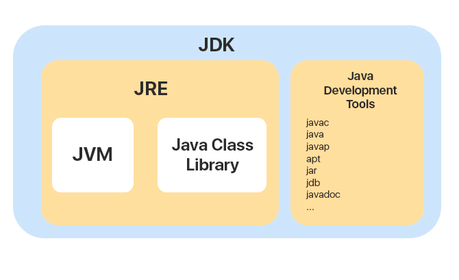

# Глава 1. JVM и первая программа

Что нужно вообще знать про джаву? Java - объектно-ориентированный язык программирования со строгой статической типизацией.

Особенность Java в том, что программы написанные на этом языке будут одинаково работать на любой операционной системе (Windows, Linux, Android и др). Это свойство называется *кроссплатформенностью*. Главное условия для его выполнения - на устройстве должна быть JVM необходимой версии.

И тут сразу же всплывает вопрос с собеседования - что такое JVM, JDK, JRE и в чем их различия.

## 1. JVM, JDK, JRE

Для того, чтобы на своем компьютере иметь возможность писать код на Java, нужно сделать следующее:

1. Установить JDK
2. Установить IDE

Что вообще происходит, когда ты пишешь код и нажимаешь на кнопку запуска программы?

1) Написание исходного кода.
Ты создаёшь файл с расширением `.java`, например `HelloWorld.java`, и прописываешь в нём код.

> Аналогия из жизни: это похоже на то, как если бы ты писал инструкцию в виде письма на родном языке.

2) Компиляция (javac)
IDE или команда javac HelloWorld.java запускает компилятор из состава JDK. Компилятор - это специальная программа, которая проверяет твой код на корректность синтаксиса и преобразует вего в *байткод* - универсальный "язык", понятный Java Virtual Machine (JVM). Результат сохраняется в файле `HelloWorld.class`.

> Аналогия из жизни: приходит переводчик и садится переводить твое письмо на международный язык, понятный любому исполнителю.

3) Загрузка байткода (Class Loader)
Запуск команды java HelloWorld или нажатие "Run" в IDE приводит к запуску JRE, которая включает в себя JVM.
JVM находит файл `HelloWorld.class`, загружает его в свою память через специальный компонент - *Class Loader*.

4) Проверека безопасности (ByteCode Verifier)
JVM проверяет загруженный байткод на соответствие спецификации: нет ли попыток обойти ограничения безопасности, не обращается ли программа к недопустимой памяти и т. д. Это как таможенный досмотр багажа перед полё

5) Интерпретация и JIT-компиляция
JVM выполняет код построчно (интерпретирует его в машинный код), как если бы переводчик переводил по одному предложению, а не весь текст разом.

Но многократное выполнение одних и тех же участков кода становится слишком затратной и бессмысленной операцией. Ведь переводчик если в десятый раз видит одну и ту же строчку, не будет лезть в словарь - он посмотрит его в уже переведенном тексте на своих черновиках.

JVM тоже не глупая - она понимает, что если определенный участок кода выполняется многократно, она компилирует байткод в машинный код "на лету" для ускорения работы, соохраняя при этом результаты в кэше. Этот процесс называется Just-In-Time компиляцией (JIT).

6) Выполнение программы
Машинные код (нативные инструкции для процессора) выполняется, и ты видишь результат программы.



Можно подытожить ответ на вопрос выше следующим:

- **JVM** — это сокращенное название от Java Virtual Machine — Виртуальная Машина Java. Обычный процессор выполняет машинный код, а JVM выполняет байт-код. Поэтому JVM — это как бы виртуальный процессор/машина.
- JVM совместно со стандартными Java-библиотеками образует **JRE** — Java Runtime Environment — Среду Выполнения Java.
- **JDK** — Java Development Kit — Набор Java-разработчика. В JDK входит JRE, а также Java-компилятор и другие программы полезные Java-разработчикам.

> Аналогия из жизни:
- **JVM** (Java Virtual Machine) — это как **двигатель** автомобиля.  
  Обычный процессор выполняет машинный код, а JVM «запускает» байт-код Java, превращая его в работу двигателя.
- **JRE** (Java Runtime Environment) — это как **сам автомобиль** со всем необходимым для поездки:  
  - двигатель (JVM)  
  - топливо и запчасти (стандартные Java-библиотеки)  
  - шасси и кузов (среда, связывающая всё вместе)  
  JRE даёт готовый автомобиль, на котором можно **ездить** (запускать Java-программы).
- **JDK** (Java Development Kit) — это как **автомастерская** с инструментами и запчастями:  
  - готовый автомобиль (JRE)  
  - набор инструментов (компилятор `javac`, отладчик, профайлер)  
  - руководство по ремонту и настройке (документация)  
  JDK позволяет не только **ездить**, но и **строить, настраивать и чинить** автомобиль (разрабатывать Java-приложения).

Давайте же начнем писать.

## 2. "Hello world" 

Прежде чем углубляться в типы даных, начнем с традиционного Hello World.

```java
public class HelloWorld {
    public static void main(String[] args) {
        System.out.println("Hello, World!");
    }
}
```

Выглядит очень страшно. Давай разбираться.

### 1. Заголовок класса

Первая строка:
```java
public class HelloWorld {
```

`public` ― модификатор доступа, означающий, что класс доступен из любого пакета.

`class` ― ключевое слово, вводящее определение класса.

`HelloWorld` ― имя класса; по соглашению, оно пишется в [CamelCase формате](https://ru.wikipedia.org/wiki/Верблюжий_регистр "wiki") и совпадает с именем файла. 

> _Java — объектно-ориентированный язык, а класс — базовый строительный блок ООП. Поэтому с классами так или иначе придется разобраться. О модификаторах доступа мы поговорим когда перейдем непосредственно к ООП._

### 2. Точка входа в программу

Следующий фрагмент - метод (функция) класса.
```java
public static void main(String[] args) {
```

`public` ― так же модификатор доступа.

`static` ― указывает, что метод принадлежит самому классу, а не его *объектам*.

`void` ― означает отсутствие возвращаемого значения. 

`main` ― зарезервированное имя метода; JVM ищет именно его для запуска программы.

`String[] args` ― массив аргументов командной строки.

Методы могут возвращать разные типы данных - численные (int), булевые (boolean), ничего не возвращать (void), либо же возвращать какие-то сложные объекты.  

По своей сути, метод - это инструкция, которую можно вызвать из другой части программы для выполнения каких-то действий. В ООП парадигме, метод - действие какого-либо объекта.

> Жизненный пример: вы - объект класса человек. Вы можете утром проснуться (метод просыпания), позавтракать (метод поглощения пищи), либо же спать до обеда (метод проспать пары). Каждый метод обозначает определенное действие, которые выполняет объект. Это может быть как атомарное действие (например сделать шаг вперед), так и комплексное (приготовить ужин). 

На первых порах мы ограничимся лишь одним методом `main`, нам будет достаточно его.

### 3. Вывод на консоль

Внутри метода мы видим страшную конструкцию:

```
System.out.println("Hello, World!");
```

`System.out` ― стандартный поток вывода.

`println(...)` ― метод, который выводит текст и переводит строку.

В кавычках — сам текст: `"Hello, World!"`.

>❓ Почему нельзя сделать проще?

Вопрос резонный — я сам пугался при первом взгляде на эту конструкцию.
Но немного поработав с потоками (а их в Java около 30) и попрактиковавшись в ООП, я увидел, как всё продумано:

`System` — класс для работы с системных потоков ввода-вывода.

`out` — статическое поле этого класса, объект типа PrintStream.

`println(...)` — метод PrintStream, выводящий строку в стандартный выходной поток.

Да, в Python или JavaScript короче — print("…") или console.log("…") — но в Java за видуемой «многословностью» стоит лаконичность и ясность для разработчика, с чем именно он работает.

Пока не стоит погружаться в детали, со всем этим мы подробно разберемся позже. А пока предлагаю установить лучшую среду разработки для Java - JetBrains IDEA по [инструкции](https://javarush.com/quests/lectures/questsyntaxpro.level20.lecture01).


## Резюме

Java — это не просто язык программирования, это философия создания кода, который «напиши один раз — запускай везде». С самого начала важно понять, как работает внутренняя кухня Java: от набора инструментов до машины, выполняющей ваши программы.

В этой главе мы заложили фундамент: познакомились с виртуальной машиной, средой выполнения и комплектом разработчика. В следующих главах мы будем разбираться уже с синтаксисом и механизмами Java для написания более сложный программ, чем приветствие мира.

