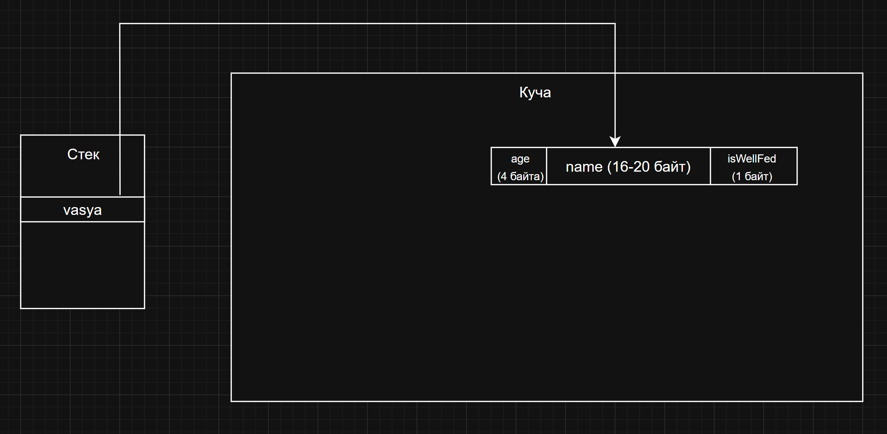

# Глава 2. Типы данных

## 1. Переменные

Представьте, что вы — маленький ребенок, который везде с собой носит коробочку. В эту коробочку вы кладете все, что вам нравится: камешки, конфеты, игрушки, мусор, но с единственным ограничением — в коробочке можно хранить **только один предмет**, или если вернуться в мир программирования — **только одно значение**.

То есть, если вы решили, что в коробочке должен лежать камень, а в ней уже есть конфета, то вы обязаны убрать конфету, и положить туда камень. Такова суровая реальность.

В Java, как и в других высокоуровневых языках программирования, вы, как разработчик, не задумываетесь над тем, куда пропадает предыдущее значение переменной. За вас его в памяти компьютера перезаписывает процессор (то есть кладет новое значение вместо старого). 

Именно так работают переменные. По сути это просто контейнеры для каких—то данных.

В Java переменные объявляются следующим образом:
```java
int a = 5; // целочисленная переменная
double b = 36.6; // число с плавающей точкой
```

Давайте поймем что тут происходит:

1) Первым словом мы **всегда пишем тип данных**. О типах данных мы поговорим ниже.
2) Затем мы пишем **имя переменной** по которому мы будем обращаться к ней, для того, чтобы работать с ее **значением**.
3) Ставим равно и пишем какое значение хотим туда положить.
4) Не забываем точку с запятой)

В нашем случае `int` и `double` являются типами данных для перменных `a` и `b` соответственно.

## 2. Кто такие эти типы

### Целые типы данных (byte, short, int, long)
```java
int a = 10, b = 3, c = 3;
System.out.println(a + b);   // 13  — обычное сложение
System.out.println(a / b);   // 3   — дробная часть отбрасывается (целочисленное деление)
System.out.println(b == c); // true — логическое значение

// Переполнение на "узком" типе
byte small = 127;            // макс. значение byte
small++;                     // +1 → «обнуляется» и уходит в –128
System.out.println(small);   // —128
```
Про переполнения подробнее [тут](https://patrakhin.github.io/posts/overflow/)

### Вещественные числа (float, double)
```java
double x = 10.0, y = 3.0;
System.out.println(x / y);   // 3.3333333333333335 — деление с остатком
System.out.println(x * y);   // 30.0
```

### Символы (char)
```java
char c = 'A';                // Юникод‑код 65
System.out.println(c);       // A
System.out.println(c + 1);   // 66 (65 + 1) — арифметика разрешена, результат → int
```

### Логический тип (boolean)
```java
boolean p = true, q = false;
System.out.println(p && q);  // false — логическое «И»
System.out.println(p || q);  // true  — логическое «ИЛИ»
System.out.println(!p);      // false — логическое «НЕ»
```

Итак, типы данных определяют два ключевых момента:  
1) Сколько памяти нужно выделить для конкретной переменной
2) Какие операции над переменной разрешены

### Строки (String)
А можно ли хранить строки? Конечно можно, например вот так:
```java
String s = "Строка с текстом";
```
Или вот так:
```java
String s2 = new String("Еще одна строка с текстом");
```

В чем разница? Почему типы данных для чисел мы обозначали с маленьких букв, а для строк — с больших? Почему можно инициализировать строковую переменную просто через кавычки, а можно через `new`? Давайте разбираться.

## 3. Примитивы vs объекты. Стек vs куча

### Примитивные типы
В Java типы данных делятся на два типа: примитивы и объекты. 

Первое относится к тем типам данных, которые пишутся с маленькой буквы (int, boolean, char и др). Они хранятся на *стеке* (кроме полей класса, но об этом позже), имеют дефолтные значения и заданный диапазон. 

### Объекты
Объекты же — это составные типы данных, которые могут иметь в себе несколько полей из примитивов или же тоже объектов. 

Например определим класс котиков, который хранит и примитивы и объекты в своих полях:

```java
public class Cat {
    int age; // примитив
    String name; // объект
    boolean isWellFed; // примитив
}
```

### Стек
Стек и куча — два отдела оперативной памяти, где JVM (или другая среда выполнения) хранит данные во время работы программы.

Стек помимо примитивов хранит вызовы функций, *ссылки на объекты* и много другой системной информации, необходимой для работы программы. Стек как правило занимает не очень много места (порядка 1—8 мегабайт по умолчанию).

### Куча
Куча — это более объемная часть памяти, которая сохраняет в себе целые объекты. Объектами в Java является все, кроме примитивов (парадоксально). Куча по умолчанию занимает несколько гигабайт.

Более подробно про работу этих двух участков памяти советую почитать [тут](https://topjava.ru/blog/stack—and—heap—in—java).

### Пример размещения объектов и ссылок
Таким образом, если мы создаем экземпляр котика:
```java
Cat vasya = new Cat(3, "Вася", false);
```
То  переменная—ссылка vasya расположится на стеке, а сам объект Cat уже на куче. Упрощенная схема изображена на рисунке



Таким образом, когда мы будем обращаться к какому—то полю объекта vasya, Java перейдет по ссылке из стека в кучу и достанет нам это поле. Например:

```java
Cat vasya = new Cat(3, "Вася", false);
System.out.println(vasya.name); // Вася
```

А что там со строками? Почему мы создавали через кавычки и через new?

## 4. Строки и строковый пул

### Сравнение строк и String pool
Мы уже убедились, что ссылки хранятся в стеке, а реальные объекты — в куче.

Но со строками всё чуть хитрее: Java держит для них отдельный шкафчик — String Pool (чаще переводят как строковый пул или таблица строк‑литералов).

Давайте рассмотрим небольшой пример и увидим магию.

```java
String s1 = "Hello";
String s2 = "Hello";
String s3 = new String("Hello");
System.out.println(s1 == s2); // true
System.out.println(s1 == s3); // false
```

В первом случае Java нам сказала, что строка s1 равна строке s2. Все логично.

Но почему s1 не равно s3? Ведь `Hello` и `Hello` ничем не отличается, можете побуквенно проверить. Java врет?

На самом деле нет. Все дело в оптимизациях JVM. В JVM строки (как и любые объекты) хранятся на куче, но в отдельной ее части, называемой стринг пулом (String pool). Java понимает, чтоо строки s1 и s2 полностью совпадают, и поэтому нет смысла выделять в памяти новый объект, ведь можно просто ссылку s2 направить в тот же участок памяти, куда указывает и s1.

А вот со сторокой s3 все просто — поскольку мы написали оператор `new`, то мы указали JVM, что нам нужно выделить именно **новый** участок памяти, в который мы положим строку `Hello` (уже другую, отличную от s1). 

Ну и последним аргументом в пользу правоты Java будет сравнение объектов. Java любые объекты сравнивает по ссылкам, если мы их пытаемся сравнить через оператор сравнения `==`. Если же мы хотим сравнить именно **содержимое** этих строк, то можно использовать метод `equals`:

```java
String s1 = "Hello";
String s2 = "Hello";
String s3 = new String("Hello");
System.out.println(s1.equals(s2)); // true
System.out.println(s1.equals(s3)); // true
```

При использовании `equals` строки сравниваются именно по **содержимому**, и в этом примере мы, логично, получаем два `true`.

### Как работает создание строк
Таким образом, последовательность создания переменной—строки для JVM следующая:
1) Если используем оператор `new`, просто выделяем новый участок памяти и указываем ссылку на него.
2) Иначе, просмотреть String pool на наличие такой же строки, и если она найдена — положить в новую переменную ссылку на нее. Если такая строка не найдена, выделить новый участок памяти и положить ссылку на нее в переменную.

Более подробно про методы работы со строками можно почитать [здесь](https://metanit.com/java/tutorial/7.2.php).

### Иммутабельность строк
Есть еще очень важный момент, который нужно знать про строки. На самом деле **строки не изменяемы**.

Как же так? Ведь мы можем спокойно выполнить следующий код:

```java
String name = "Вася";
name += " Пупкин";
System.out.println(name); // Вася Пупкин
```

Кажется, что строка изменилась, ведь это логично видно из вывода программы. Но все сложнее.

Что на самом деле происходит в этот момент:
1) Первая строка кладёт в переменную name ссылку на готовый литерал "Вася" из строкового пула.
2) Оператор `+=` не пытается "дописать" символы в тот же объект — вместо этого компилятор разворачивает его в `name = new StringBuilder(name).append(" Пупкин").toString();`. 
3) StringBuilder склеивает два текста и вызывает `.toString()`, которое отдаёт совершенно новый объект — уже в обычной куче. Переменная name переезжает на эту свежесозданную строку; старая "Вася" остаётся нетронутой и может жить дальше, если где‑то ещё на неё ссылаются (например, в пуле).

То есть мы не «меняем» строку, а просто оставляем старую и берём новую.

Представьте, что каждая строка в Java — это табличка, приклеенная к двери. Как только клей застыл, надпись уже не сломать и не заменить: можно лишь перевесить табличку или сделать новую. Эта "застывшая надпись" и есть **иммутабельность** (immutable), то есть неизменяемость.

Зачем такой жёсткий подход? Во‑первых, ради экономии памяти. Строки‑литералы лежат в строковом пуле и могут раздаваться разным переменным как визитные карточки: надпись одна, а держателей десятки.

Во‑вторых, безопасность. Представь, что веб‑приложение сначала проверяет строку‑путь "uploads/avatar.png": убеждается, что она лежит только в папке /uploads, не содержит ../, нет спец‑символов. Проверка прошла — значит, строке доверили и передают её дальше, например в код, который реально открывает файл. Если бы строка могла меняться, злоумышленник, удерживая ссылку на тот же объект, мог бы между этими двумя шагами превратить путь в "../../etc/passwd" и получить доступ к системным файлам.

Иммутабельность обрубает атаку «в два приёма»: после валидации объект уже забетонирован — во время передачи по цепочке методов его содержимое гарантированно остаётся тем же самым. Тот же принцип защищает и любые другие критические строки, по которым принимаются решения — от имён классов в механизме ClassLoader до ключей доступа в SecurityManager: проверил один раз — можешь больше не оглядываться, строку никто тихонько не подменит.

Наконец, производительность JIT‑компилятора. Иммутабельные строки компилятор смело «сворачивает» в константы и вклеивает прямо в байткод, сокращая время на склейку каждого «Hello, " + name`. Если бы строки можно было править, о таких оптимизациях пришлось бы забыть.

Итог: клей на табличке — это гарант, что память используется бережно, потоки не дерутся, а виртуальная машина может разгоняться до максимума, не опасаясь внезапных «редактирований» текста на ходу.

### Внутреннее устройство строк
И последнее, что сегодня обсудим про строки — их представление в коде (привет Си с ее char[]).

Строка в Java — это не «голый» массив букв, а целая коробка‑органайзер.

Внутри, конечно, лежит набор символов (до Java 9 — char[], с Java 9 — компактный byte[] плюс флажок‑кодировщик), но рядом прячутся служебные ярлыки: закэшированный hash, метка кодировки, да и сам буфер объявлен final, чтобы никто не дорвался переклеить буквы. 

## Резюме
В этой главе мы разобрались, с тем, как Java хранит наши данные — с помощью переменных. Коробочка‑переменная всегда вмещает только один предмет: положил камень — конфету придётся вынуть. Чтобы компьютер знал, сколько места резервировать под этот «камень» и какие с ним допустимы действия, мы клеим на коробку ярлык‑тип. Примитивы (int, double, boolean…) легки и просты: живут на стеке, имеют фиксированный вес и набор операций. Объекты же — настоящие матрёшки: сами лежат в куче, а на стеке остаётся лишь ссылка‑указатель.

Самый яркий пример — строки. Литералы в кавычках JVM складывает в отдельный «строковый пул», чтобы не плодить дубликаты: две переменные могут смотреть на один и тот же "Hello". А вот `new String("Hello")` — вынужденная роскошь, создающая свежий объект в куче и отнимающая лишние байты.

В сухом остатке: типы данных определяют объём памяти и набор допустимых операций, стек хранит примитивы и ссылки, куча — реальные объекты, а строковый пул экономит место, повторно используя одинаковые тексты.

## Доп материалы
1. Методы работы со строками: https://metanit.com/java/tutorial/7.2.php
2. Переполнение типов: https://patrakhin.github.io/posts/overflow/
3. Работа стека и кучи: https://topjava.ru/blog/stack—and—heap—in—java
4. StringBuilder: https://metanit.com/java/tutorial/7.3.php
5. Консольный ввод-вывод (без этого домашку не сделать): https://metanit.com/java/tutorial/2.9.php

## Домашнее задание
### Задача 1. Сумма двух чисел
**Условие:**  
Даны два целых числа `a` и `b`. Напишите программу, которая вычисляет их сумму.

**Входные данные:**  
Два числа через пробел (`-100 ≤ a, b ≤ 100`).

**Выходные данные:**  
Одно число — результат сложения.

**Пример:**  
Вход: 5 3
Выход 8

---
### Задача 2. Деление с точностью
**Условие:**  
Даны два целых числа `x` и `y`. Выведите результат деления `x / y` с точностью до 3 знаков после запятой.

**Входные данные:**  
Два числа через пробел (`1 ≤ y ≤ 100`, `-1000 ≤ x ≤ 1000`).

**Выходные данные:**  
Вещественное число (округлить до 3 знаков).

**Пример:**  
Вход: 7 3
Выход: 2.333

---
### Задача 3. Следующий символ
**Условие:**  
Дана английская буква в нижнем регистре. Выведите следующий за ней символ в алфавите (если это 'z', выведите 'a').

**Входные данные:**  
Один символ (`a ≤ char ≤ z`).

**Выходные данные:**  
Один символ.

**Пример:**  
Вход: c
Выход: d

---
### Задача 4. Длина строки
**Условие:**  
Дана строка `s` (без пробелов). Выведите её длину.

**Входные данные:**  
Строка (до 100 символов).

**Выходные данные:**  
Целое число — длина строки.
Вход: "hello"
Выход: 5

---

### Задача 5. Чётное/нечётное
**Условие:**  
Дано целое число `n`. Определите, является ли оно чётным.

**Входные данные:**  
Одно число (`-1000 ≤ n ≤ 1000`).

**Выходные данные:**  
Строка `"even"` (чётное) или `"odd"` (нечётное).

**Пример:**  
Вход: 7
Выход: odd