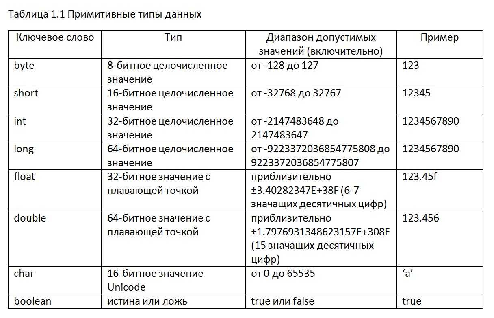
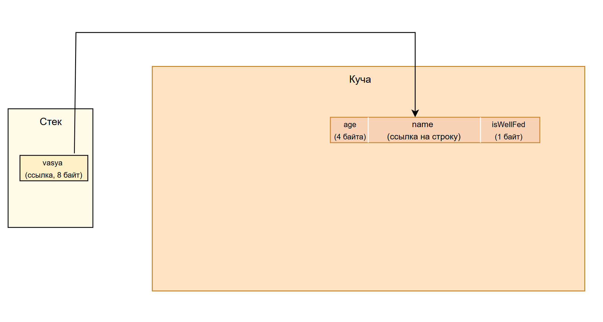

# Глава 2. Типы данных

## 1. Переменные

Представьте, что вы - маленький ребенок, который везде с собой носит коробочку. В эту коробочку вы кладете все, что вам нравится: камешки, конфеты, игрушки, мусор, но с единственным ограничением - в коробочке можно хранить **только один предмет**, или если вернуться в мир программирования - **только одно значение**.

То есть, если вы решили, что в коробочке должен лежать камень, а в ней уже есть конфета, то вы обязаны убрать конфету, и положить туда камень. Такова суровая реальность.

В Java, как и в других высокоуровневых языках программирования, вы, как разработчик, не задумываетесь над тем, куда пропадает предыдущее значение переменной. За вас его в памяти компьютера перезаписывает процессор (то есть кладет новое значение вместо старого). 

Именно так работают переменные. По сути это просто контейнеры для каких-то данных.

В Java переменные объявляются следующим образом:
```java
int a = 5; // целочисленная переменная
double b = 36.6; // число с плавающей точкой
```

Давайте поймем что тут происходит:

1) Первым словом мы **всегда пишем тип данных**. О типах данных мы поговорим ниже.
2) Затем мы пишем **имя переменной** по которому мы будем обращаться к ней, для того, чтобы работать с ее **значением**.
3) Ставим равно и пишем какое значение хотим туда положить.
4) Не забываем точку с запятой)

В нашем случае `int` и `double` являются типами данных для перменных `a` и `b` соответственно.

## 2. Кто такие эти типы

В примерах выше внимательный читатель мог заметить, что у переменной `a` значение **целочисленное**, а у переменной `b` - **дробное**. Какие объекты из реальной жизни могут представлять эти переменные?

Например, переменная `a` может обозначать оценку в дневнике у ученика, т.к. оценка может быть только целой, в каком-то диапазоне (например от 2 до 5).

А переменная `b` может обозначать температуру тела человека, т.к. в этом вопросе важна точность до десятых.

Таким образом, в программировании мы для всякой переменной задаем *тип данных*, чтобы он мог корректно обозначать то, какие значения может в себе может хранить переменная.

Полный перечень типов данных приведен в таблице ниже:



Заметим, что во втором столбце указано какое-то количество бит. Что это значит?

Современные домашние компьютеры способны хранить на жестких дисках терабайты данных. И под каждый тип данных выделять одинаковое количество байт (допустим 8 байт, как для самого жирного типа - double) тупо не выгодно. Как например, если бы вы решили обозначить, что каждый отдельный абзац вы будете писать на новой странице, даже если старая не заполнена до конца.

Есть ещё важный аспект — допустимые операции. Числа можно без труда складывать, а вот «сложить» две буквы уже не имеет смысла. У логических (булевых) значений вовсе действует особая [булева алгебра](https://ru.wikipedia.org/wiki/Булева_алгебра). Каждый тип данных *по своему обрабатывает и хранит значения*.

Давайте рассмотрим как в Java можно оперировать различными типами данных:

1. Целые типы данных (byte, short, int, long)
```java
int a = 10, b = 3;
System.out.println(a + b);   // 13  — обычное сложение
System.out.println(a / b);   // 3   — дробная часть отбрасывается (целочисленное деление)

// Переполнение на "узком" типе
byte small = 127;            // макс. значение byte
small++;                     // +1 → «обнуляется» и уходит в –128
System.out.println(small);   // -128
```
Про переполнения подробнее [тут](https://patrakhin.github.io/posts/overflow/)

2. Вещественные числа (float, double)
```java
double x = 10.0, y = 3.0;
System.out.println(x / y);   // 3.3333333333333335 — деление с остатком
System.out.println(x * y);   // 30.0
```

3. Символы (char)
```java
char c = 'A';                // Юникод‑код 65
System.out.println(c);       // A
System.out.println(c + 1);   // 66 (65 + 1) — арифметика разрешена, результат → int
```

4. Логический тип (boolean)
```java
boolean p = true, q = false;
System.out.println(p && q);  // false — логическое «И»
System.out.println(p || q);  // true  — логическое «ИЛИ»
System.out.println(!p);      // false — логическое «НЕ»
```

Итак, типы данных определяют два ключевых момента:  
1) Сколько памяти нужно выделить для конкретной переменной
2) Какие операции над переменной разрешены

А можно ли хранить строки? Конечно можно, например вот так:
```java
String s = "Строка с текстом";
```
Или вот так:
```java
String s2 = new String("Еще одна строка с текстом");
```

В чем разница? Почему типы данных для чисел мы обозначали с маленьких букв, а для строк - с больших? Почему можно инициализировать строковую переменную просто через кавычки, а можно через `new`? Давайте разбираться.

## 3. Примитивы vs объекты. Стек vs куча

В Java типы данных делятся на два типа: примитивы и объекты. 

Первое относится к тем типам данных, которые пишутся с маленькой буквы (int, boolean, char и др). Они хранятся на *стеке* (кроме полей класса, но об этом позже), имеют дефолтные значения и заданный диапазон. 

Объекты же - это составные типы данных, которые могут иметь в себе несколько полей из примитивов или же тоже объектов. 

Например определим класс котиков, который хранит и примитивы и объекты в своих полях:

```java
public class Cat {
    int age; // примитив
    String name; // объект
    boolean isWellFed; // примитив
}
```

Стек и куча - два отдела оперативной памяти, где JVM (или другая среда выполнения) хранит данные во время работы программы.

Стек помимо примитивов хранит вызовы функций, *ссылки на объекты* и много другой системной информации, необходимой для работы программы. Стек как правило занимает не очень много места (порядка 1-8 мегабайт по умолчанию).

Куча - это более объемная часть памяти, которая сохраняет в себе целые объекты. Объектами в Java является все, кроме примитивов (парадоксально). Куча по умолчанию занимает несколько гигабайт.

Более подробно про работу этих двух участков памяти советую почитать [тут](https://topjava.ru/blog/stack-and-heap-in-java).

Таким образом, если мы создаем экземпляр котика:
```java
Cat vasya = new Cat(3, "Вася", false);
```
То  переменная-ссылка vasya расположится на стеке, а сам объект Cat уже на куче. Упрощенная схема изображена на рисунке



Таким образом, когда мы будем обращаться к какому-то полю объекта vasya, Java перейдет по ссылке из стека в кучу и достанет нам это поле. Например:

```java
Cat vasya = new Cat(3, "Вася", false);
System.out.println(vasya.name); // Вася
```

А что там со строками? Почему мы создавали через кавычки и через new?

## 4. Строки и строковый пул

Мы уже убедились, что ссылки хранятся в стеке, а реальные объекты — в куче.

Но со строками всё чуть хитрее: Java держит для них отдельный шкафчик — String Pool (чаще переводят как строковый пул или таблица строк‑литералов).


